# Cycling

## Extract Stats from Strava

Common formats of sports: `TCX`, `GCX`, `FIT`

Steps to export `TCX` from Strava:

1. Login to [strava](https://www.strava.com/dashboard).
2. Click the activity you want to export.
3. "Simply add "/export_tcx" - without quotes - to the end of your activity page URL. For example, if your activity page is www.strava.com/activities/2865391236 - just add the text to give you www.strava.com/activities/2865391236/export_tcx and hit enter."

Reference:

- [Export tcx from Strava](https://support.strava.com/hc/en-us/articles/216918437-Exporting-your-Data-and-Bulk-Export)
- [About file extension for sport activity](https://medium.com/decathlondigital/gpx-tcx-fit-how-to-choose-the-best-file-extension-for-sport-activity-transfer-403487337c04)

## 🖥️ Dependencies

### Python Environment

```bash
python3 -m venv .venv
source .venv/bin/bash
pip3 install -r requirements.txt
```

### Ollama

To utilised local LLMs as customised performance coach.

1. Install [Ollama desktop](https://ollama.com).
2. Build the custom model file. This example used `qwen2.5:7b`.

   ```bash
   ollama create cycling-qwen2.5:7b -f Modelfile
   ```

   **\*Remarks**: Some contents in the system prompts of the Modelfile are from references below.\*

3. Questions:
   - How's my workout effort?
   - How to improve my stamina?

## 📈 Streamlit Dashboard

Check out the Streamlit [app](./app/) for workout analysis & performance management.

### Start Streamlit App

```bash
cd app/
streamlit run Workout_Analysis.py
```

### Dashboard Preview

#### Workout Summary

Upload the `.tcx` file of the workout to get the workout summary.

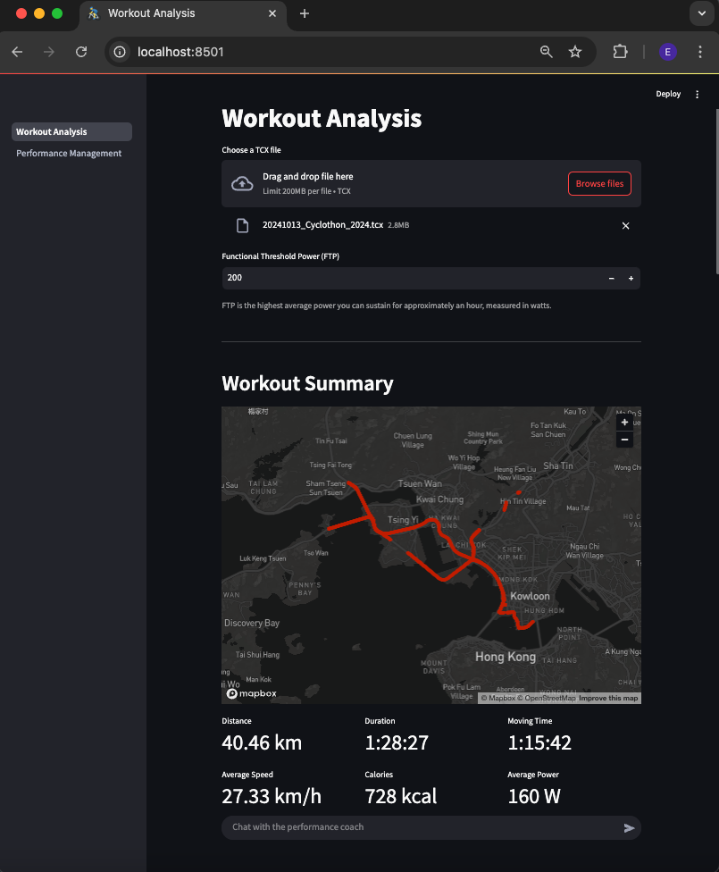

#### Basic Stats

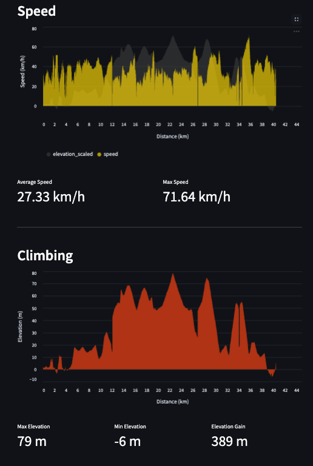
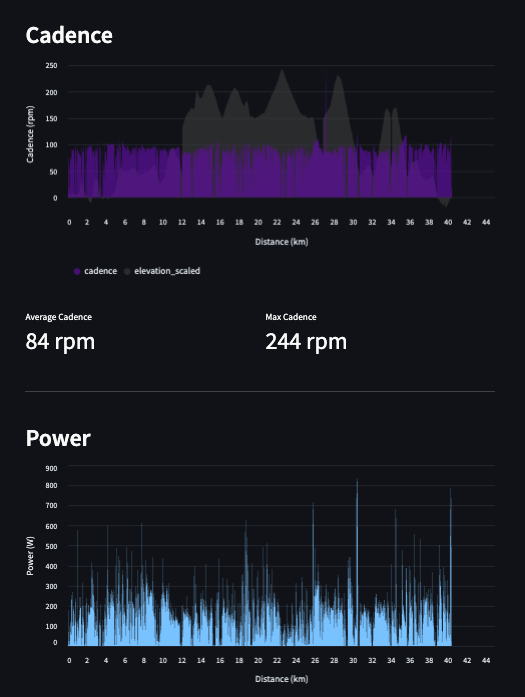

#### Detailed Power Stats

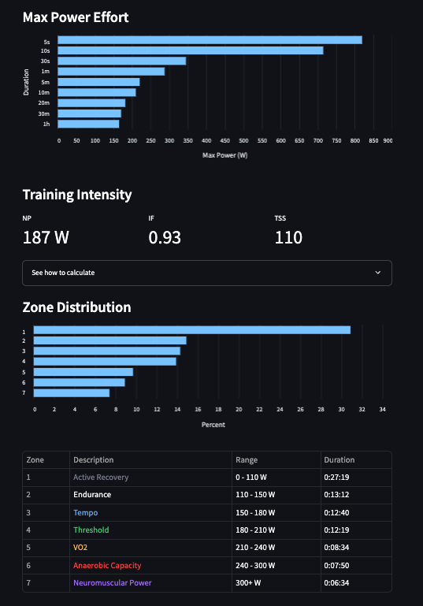

#### Performance Coach on Workout (Qwen 2.5:7b)

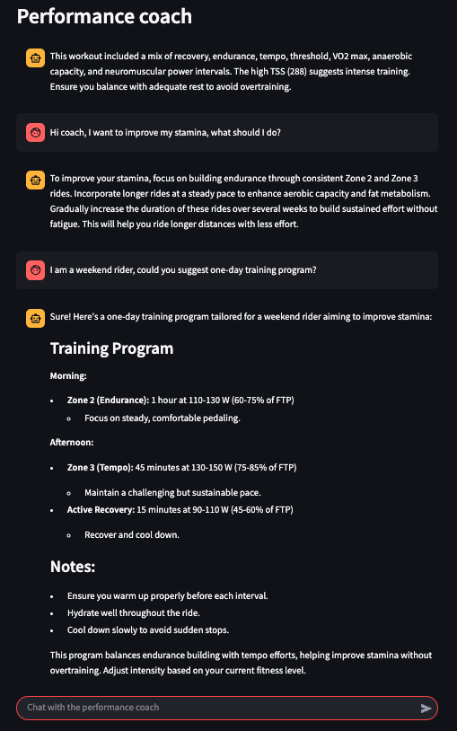

#### Weekly TSS

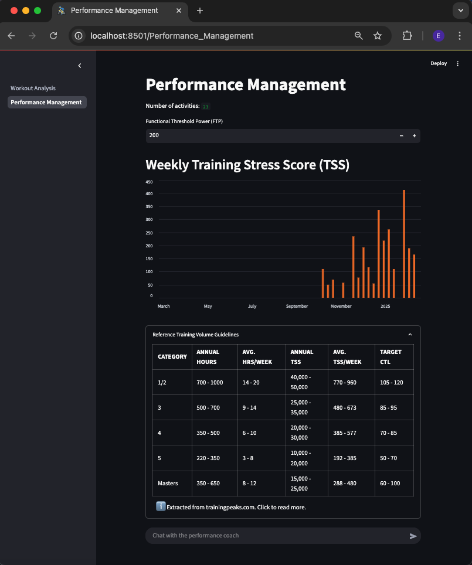

#### CTL & ATL

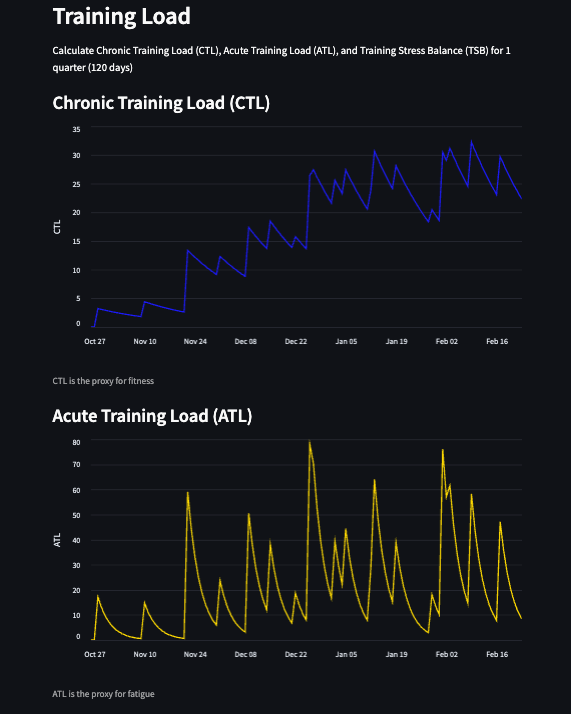

#### TSB & Performance Management Chart

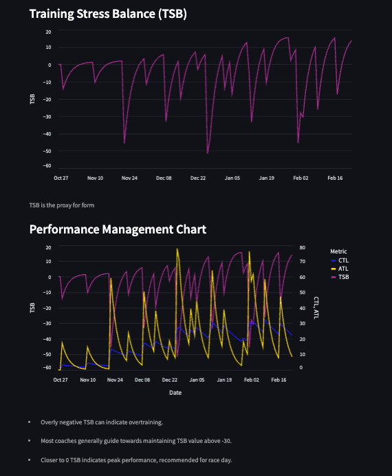

#### Performance Coach on Performance (Qwen 2.5:7b)

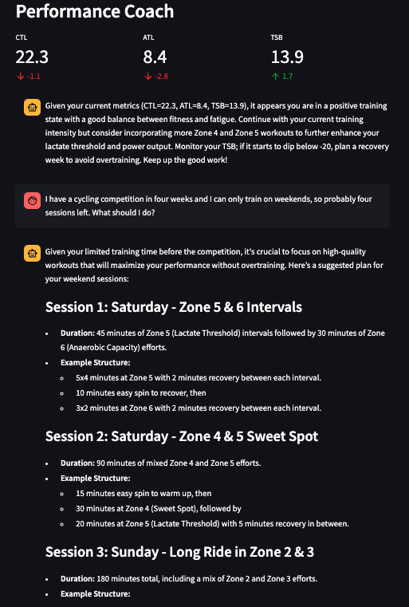
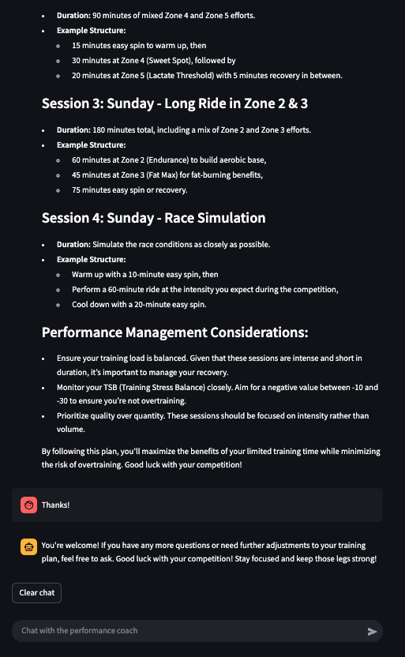

### References

1. [Power Zones by Strava](https://stories.strava.com/articles/feel-the-power-calculate-your-training-pacing-zones-know-what-they-feel-like)
2. [Power Zones by Pro Cycling Coaching](https://www.procyclingcoaching.com/resources/power-training-zones-for-cycling)
3. [Strava Guide: Features to Take Your Training to The Next Level](https://stories.strava.com/articles/strava-guide-features-to-take-your-training-to-the-next-level)
4. [TSS, IF, NP](https://www.trainerroad.com/blog/tss-if-and-workout-levels-3-metrics-to-help-you-understand-your-training-and-get-faster/)
5. [TSS by Peaksware](https://www.trainingpeaks.com/learn/articles/how-to-plan-your-season-with-training-stress-score/)
6. [CTL by Peaksware](https://www.trainingpeaks.com/learn/articles/applying-the-numbers-part-1-chronic-training-load/)
7. [A blog about CTL and ATL](https://ssp3nc3r.github.io/post/2020-05-08-calculating-training-load-in-cycling/)
8. [More indepth CTL and ATL analysis](https://konakorgi.com/2020/01/29/entry-5-rest-and-recovery-part-1-managing-fatigue/)
9. [A blog about CTL, ATL, and TSB in Chinese](https://zhuanlan.zhihu.com/p/389912897)

## ⛏️Tools

Check out the tools under [tools](./tools) directory.

### Basic Stats

Run the `stats.py` with the exported `.tcx` file as input.

```bash
python3 stats.py -i <your-activity>.tcx
```

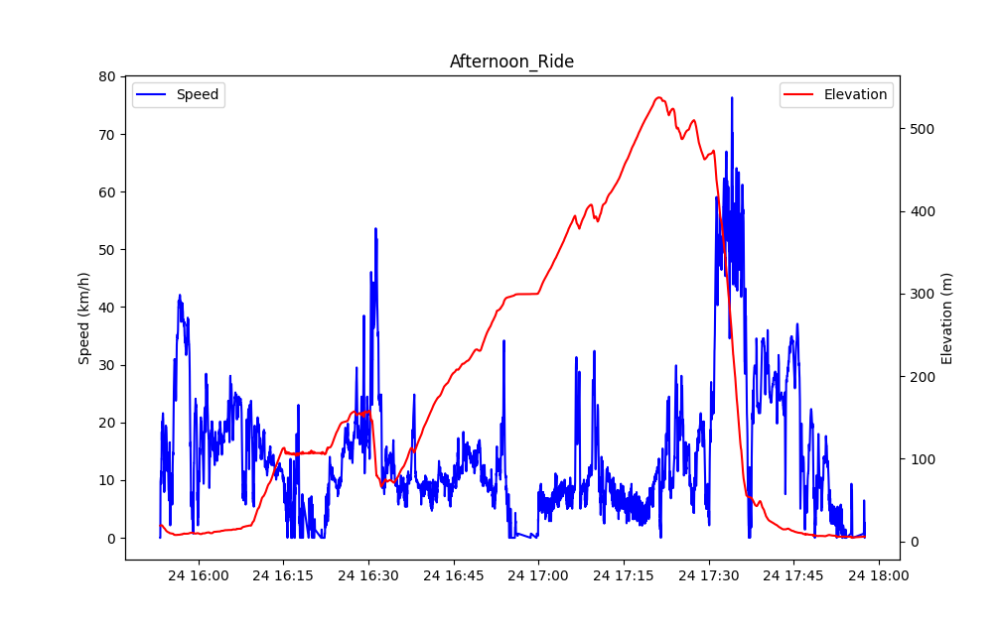

### Match Stats with Video

Run the `match_video.py` with the start time and end time of the video

```bash
python3 match_video.py --input-video <input.mp4> --input-file <input.tcx> --output-path <output.mp4> --kph --start-time <YYYY-MM-DD HH:MM:SS> --end-time <YYYY-MM-DD HH:MM:SS> --timezone <X>
```

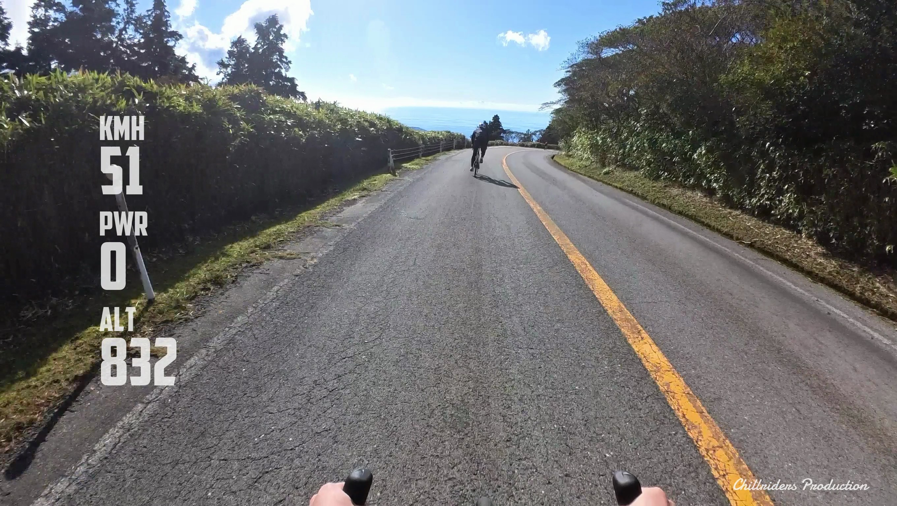

## Extract and Combine Audio

Use ffmpeg to extract the audio from original video:

```bash
docker run -it --rm -v ${PWD}:/app/ -w /app/ jrottenberg/ffmpeg -i <input-video> -vn -acodec copy <output-audio>.aac
```

Use ffmpeg to combine audio to output video:

```bash
docker run -it --rm -v ${PWD}:/app/ -w /app/ jrottenberg/ffmpeg -i <input-video> -i <input-audio>.aac -c:v copy -c:a aac <output-video>
```

### Fonts

`PIL` allows drawing texts with `.ttf` fonts. The [fonts](./tools//fonts/) are downloaded from [fontspace](https://www.fontspace.com).
